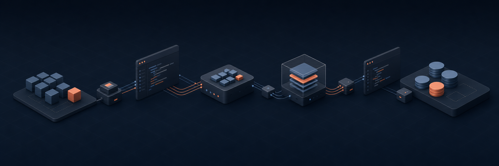

<div align="center">



# Narrative Skills Marketplace

**An agent skills marketplace from [Narrative I/O](https://narrative.io).**

Interactive, AI-powered workflows that walk you through the recurring
work of a modern data company — mapping schemas, writing NQL,
qualifying leads, shipping code, building decks — one approval at a time.

[](https://github.com/narrative-io/narrative-skills-marketplace/actions/workflows/ci.yml)
[](LICENSE)
[](https://agentskills.io)
[](https://biomejs.dev)
[](https://bun.sh)
[](tsconfig.json)
[](https://knip.dev)
[](AGENTS.md)

</div>

---

> **Versioning.** The marketplace as a whole ships under
> [CalVer](RELEASING.md) (`YYYY.MM.PATCH`) — see the
> [latest release](https://github.com/narrative-io/narrative-skills-marketplace/releases/latest)
> for what's stable today. Individual plugins and skills carry their
> own SemVer in their manifests and may iterate between marketplace
> releases. Pin a release tag (e.g.
> `git checkout v2026.05.0`) — not `main` — if you depend on a
> specific shape; `main` moves between tagged releases.

## What is this?

A **marketplace** of agent skills. Each plugin bundles one or more
**skills** — interactive slash commands like `/write-nql` or
`/generate-rosetta-stone-mappings` that turn a recurring task into a
guided, AI-augmented workflow.

Install the marketplace, type a slash command in your agent, and the
skill takes it from there: it asks the right questions, does the
research, drafts the artifact, and waits for your approval before
acting on anything outside your repo.

Skills follow the [Agent Skills spec](https://agentskills.io) and run
in any spec-compliant harness. The bundled `bash setup` installer has
two modes: a Claude Code path (uses the `claude` CLI to register the
marketplace) and a `--portable` path that builds a `dist/` tree any
agentskills.io-compliant harness can consume — see
[Install on other harnesses](#install-on-other-harnesses).

Every rendered `SKILL.md` is **committed**; CI fails if any rendered
file is stale relative to its `.tmpl`. Other harnesses can clone this
repo (or read from `raw.githubusercontent.com`) without running Bun.

> **Want the design philosophy?** See
> [AGENTS.md](AGENTS.md#skill-design-principles) — "interactive, not
> reference," "drafts, not actions," "evidence over assumptions," etc.

## Install on Claude Code

```bash
git clone https://github.com/narrative-io/narrative-skills-marketplace
cd narrative-skills-marketplace
bash setup
```

`setup` registers the marketplace, installs every plugin listed
below, and regenerates the catalog in this README.

**Requirements**

- [Claude Code](https://claude.com/claude-code) CLI on `PATH`
- [Bun](https://bun.sh) ≥ 1.1 (used for template rendering + scripts)

## Install on other harnesses

The skills are spec-portable. Each `plugins/<plugin>/skills/<skill>/`
directory is a self-contained Agent Skill (rendered `SKILL.md` plus any
`references/` / `scripts/` / `assets/`). The discovery index lives at
[`skills.json`](skills.json); MCP server configs live under
[`mcp/`](mcp/).

To build a flat, plugin-namespace-free distribution at `dist/`:

```bash
bash setup --portable      # or: bun run build:portable
```

This emits `dist/skills/<skill>/` (one folder per skill, no plugin
nesting), `dist/mcp/*.mcp.json`, and `dist/skills.json`. Then:

| Harness | How to install |
|---------|----------------|
| [Claude Code](https://claude.com/claude-code) | Use the default `bash setup` (registers the marketplace). |
| [Claude.ai web Skills](https://claude.ai/settings/capabilities) | Zip each `dist/skills/<skill>/` directory and upload it under Settings → Capabilities → Skills. |
| Claude Desktop (Mac) | `cp -R dist/skills/* "$HOME/Library/Application Support/Claude/skills/"`, then merge [`mcp/all.mcp.json`](mcp/all.mcp.json) into `claude_desktop_config.json`. |
| Claude Desktop (Windows) | `cp -R dist/skills/* "$APPDATA/Claude/skills/"`, then merge `mcp/all.mcp.json` into `claude_desktop_config.json`. |
| [Cursor](https://cursor.com) | Copy `dist/skills/*/SKILL.md` into `.cursor/rules/` in your project. MCP servers go in `~/.cursor/mcp.json` (paste from `mcp/all.mcp.json`). |
| Generic MCP-aware agent | Point the agent at `dist/skills/` as its skills root and register the servers in `mcp/all.mcp.json` via your harness's MCP config. |

**One Claude-Code-specific dependency:** the skills currently use
`AskUserQuestion` (a Claude Code primitive) for interactive prompts.
It's declared in `compatibility.recommends.tools`, not `requires`, so
spec-compliant harnesses without it should fall through to the
documented prose Q&A fallback in each skill's `## Harness fallbacks`
section.

<!-- BEGIN PLUGINS -->
## Plugins

### `narrative-common`

Common Narrative workflows backed by the narrative-mcp server — starting with Rosetta Stone attribute mapping generation, evaluation, and improvement.

| Skill | Use when |
|-------|----------|
| `/apply-rosetta-stone-mappings` | "apply these mappings to dataset N", "create the Rosetta Stone mappings I just generated", "push the mappings I saved earlier to <dataset>", "productionize this mapping list", "submit the suggested_mappings array". |
| `/create-workflow` | "create a workflow that does X", "schedule a daily refresh of dataset Y", "wrap this NQL as a workflow", "build a pipeline that creates view A then refreshes view B", "submit this workflow YAML", "productionize this query as a recurring job". |
| `/design-analysis` | "why did X drop", "is there a relationship between A and B", "who are our highest-value customers", "what's driving the change in Y", "investigate this trend", "design an analysis for", "scope this analytical question". |
| `/find-attribute` | "find the X attribute", "what's the graph-edge attribute ID", "look up the email Rosetta Stone attribute", "search the attribute catalog for Y", "which attribute has SOURCE_ID + TARGET_ID + IS_DIRECTED". |
| `/generate-rosetta-stone-mappings` | "map this dataset to Rosetta Stone", "suggest normalized attributes for dataset N", "evaluate the mappings on dataset N", "why is this mapping low confidence", "fix this expression", "improve this NQL mapping expression". |
| `/write-nql` | "write an NQL query for X", "query this dataset", "validate this NQL", "run NQL against dataset <id>", "how many rows match Y", "show me the top N records from <dataset>". |

### `narrative-identity`

Identity-graph workflows backed by the narrative-mcp server — pre-graph data-quality auditing, edge-quality analysis, and graph-build hygiene.

| Skill | Use when |
|-------|----------|
| `/generate-identity-graph` | "build an identity graph", "generate an identity graph", "create an identity graph", "stitch these datasets into a graph", "make a graph workflow", "label connected components on these datasets", "I want a person graph / household graph / device graph". |
| `/generate-match-report` | "how does my data compare to your marketplace", "compare my data to [partner]", "how much overlap do I have with [supplier]", "run a match report", "match my customers against 3P data", "see what enrichment is available for my dataset", or any open-ended question about marketplace overlap. |
| `/triage-pregraph-data` | "audit this dataset before the graph build", "audit this access rule before the graph build", "find bad edges in <source>", "check identity data quality", "recommend filters for the graph build", "find hub identifiers in <source>", "quantify damage from <identifier_type>", "pre-graph DQ". |

<!-- END PLUGINS -->

## What's a skill?

A skill is a single `SKILL.md` file with YAML frontmatter and a
numbered, phased workflow. The frontmatter declares what tools the
skill can call; the body walks the user through the work, one
question at a time, drafting artifacts and waiting for approval at
each gate.

```yaml
---
name: write-nql
version: 1.0.0
description: |
  Compose, validate, and run NQL against a Narrative dataset.
  Use when: "write an NQL query for X", "validate this NQL".
allowed-tools:
  - Bash
  - Read
  - AskUserQuestion
---

## Phase 1. Pin the dataset

…
```

Some skills reuse boilerplate via the snippet system — author a
`SKILL.md.tmpl` with `{{SNIPPET:pin-company-context}}` and `bun run
gen:skill-docs` renders the final `SKILL.md`. See
[AGENTS.md → Template system](AGENTS.md#template-system).

## Development

```bash
bun install                  # install dev deps (Biome, Knip, TS)
bun run gen:skill-docs       # render SKILL.md from SKILL.md.tmpl files
bun run check                # Biome — format + lint
bun run check:fix            # Biome — autofix everything safe
bun run typecheck            # tsc --noEmit, strict mode
bun run knip                 # find unused deps / files / exports
bun run check:manifests      # validate marketplace.json + plugin.json + SKILL.md
bun run check:skill-docs     # fail if any SKILL.md is stale vs. its .tmpl
bun run ci                   # everything CI runs, in order
```

Every check above runs in [CI](.github/workflows/ci.yml) on push and
PR — including [shellcheck](https://www.shellcheck.net) on the
`setup` script. Biome is configured with the strictest practical
ruleset (all rule groups + nursery + pedantic style/correctness/
suspicious rules); see [`biome.json`](biome.json).

## Contributing

[`docs/authoring-skills.md`](docs/authoring-skills.md) is the canonical
guide for writing a new skill — frontmatter contract, description
writing, phased body structure, progressive disclosure, composing
skills, the template / snippet system, and CI checks.

[AGENTS.md](AGENTS.md) is the quick reference for the same material
and covers:

- Project structure (`plugins/<plugin>/skills/<skill>/SKILL.md`)
- Naming conventions (verb-noun: `/triage-lead`, `/create-deck`)
- The `SKILL.md` format + the 1024-char description cap
- Skill design principles (interactive, drafts-not-actions, etc.)
- The snippet / template system

Pull requests go through the CI gauntlet above; the `Plugins`
catalog in this README regenerates itself from each skill's
frontmatter — edit the frontmatter, not the table.

## Acknowledgements

The interactive, phased structure of these skills was inspired by
[Garry Tan's gstack](https://github.com/garrytan/gstack). Thanks
to that project for the pattern of slash-command-driven workflows
with explicit approval gates.

## License

[MIT](LICENSE) © 2026 Narrative I/O
