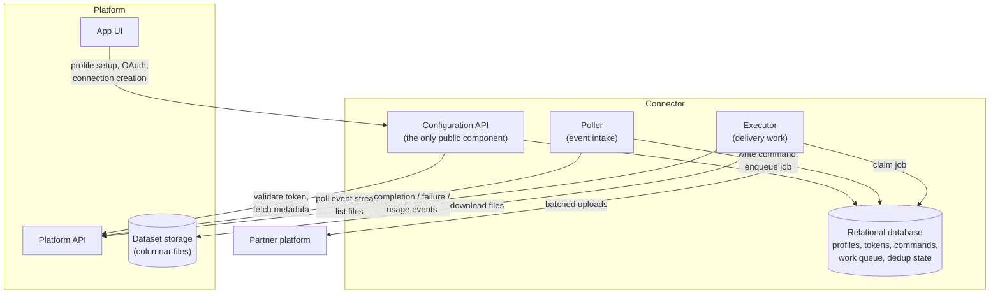
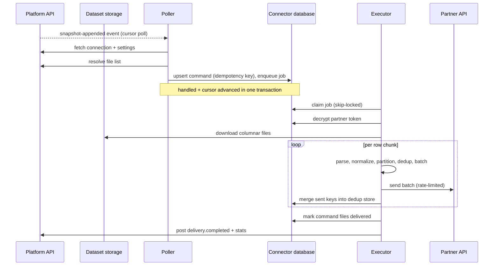

# Connector Reference Architecture

This document generalizes the architecture shared by production
connectors built against the platform. It describes the parts of the
system in language-agnostic terms: any of these components could be built
in any language or framework. It is distilled from a fleet of shipped
connectors spanning ad platforms, DSPs, SSPs, and cloud storage
destinations, and the shared framework they are built on.

## What a connector is

A connector is a small distributed system that moves data between the
platform and one external partner platform (an ad platform, a DSP, an
SSP, a cloud bucket). Its main job is outbound delivery: when a
customer's dataset changes, the connector picks up the new data,
transforms it into the partner's required shape, and uploads it to the
partner. Some connectors also carry data in the other direction,
ingesting partner-produced measurement files or opt-out logs back into
platform datasets.

Every connector solves the same set of problems:

1. **Configuration** — let a customer authorize the connector against the
   partner (OAuth or credentials), and bind a dataset to a delivery target with
   partner-specific settings.
2. **Event intake** — notice that new data exists and turn that fact into
   durable, idempotent units of work.
3. **Delivery execution** — read the data, extract and normalize identifiers or
   events, batch them within the partner's limits, and send them, surviving
   retries without duplicating deliveries.
4. **Status reporting** — tell the platform (and through it, the customer) what
   happened: rows delivered, failures, quota problems, usage for billing.

## System context

```
                 ┌────────────────────────────────────────────┐
                 │                  Platform                  │
                 │                                            │
                 │  UI ── configuration calls                 │
                 │  Platform API ── event stream, file        │
                 │      listings, status events, usage        │
                 │  Object storage ── dataset snapshots       │
                 │      (columnar files), ingestion inboxes   │
                 └───────┬──────────────▲─────────────────────┘
                         │              │
        config calls,    │              │  status events,
        events, files    │              │  opt-out / measurement
                         ▼              │  ingestion
                 ┌──────────────────────┴─────────────────────┐
                 │                 Connector                  │
                 │   (config API, poller, executor, database) │
                 └───────┬──────────────▲─────────────────────┘
                         │              │
        audience / event │              │  measurement files,
        uploads          │              │  async job status
                         ▼              │
                 ┌──────────────────────┴─────────────────────┐
                 │              Partner platform              │
                 │   (ads API, file drop endpoint, bucket)    │
                 └────────────────────────────────────────────┘
```

The connector sits between two systems it does not control. Toward the
platform, it is a registered application: it authenticates with its own client
credentials, consumes a command stream, downloads dataset files, and posts
status events. Toward the partner, it acts on behalf of the customer, using
credentials the customer granted during setup.

## Anatomy of a connector

A connector decomposes into four runtime components plus shared libraries and a
database. The components are separate deployables so they can scale and fail
independently, but smaller connectors collapse several of them into one
process.



### Configuration API

A small HTTP service, and the only publicly reachable component. It serves the
connector's setup experience:

- **Interface catalog.** The connector publishes the kinds of connections it
  supports ("deliver to a new audience", "deliver to existing audiences",
  "opt-out", "conversion events"), each with a machine-readable settings schema.
  The platform UI renders configuration forms directly from these schemas, so
  adding a setting is a connector-side change only. The catalog and the
  connection endpoint are defined in an interface definition language, so both
  sides share one typed contract.
- **Connection validation.** When a customer binds a dataset to the connector,
  the platform calls the connector with the dataset's schema and the chosen
  settings. The connector validates compatibility (are the columns it needs
  present, are the settings well-formed, do the referenced partner resources
  exist) before the connection is accepted.
- **Profile and credential management.** Profiles hold the customer's
  partner-side identity: OAuth tokens, account IDs, bucket locations. The API
  hosts the OAuth redirect flow, exchanges authorization codes for tokens,
  encrypts tokens with a managed key service, and stores them in the database.
- **Delegated authentication.** The API does not manage users. The platform UI
  passes the customer's platform token with each request, and the connector
  validates it against the platform. The connector holds partner credentials,
  never platform user credentials.

### Poller (event intake)

A headless daemon that discovers work. It runs a small number of loops
concurrently:

- **Event stream consumer.** The platform exposes delivery events (connection
  created, snapshot appended to a dataset) as a cursor-based stream: the
  consumer stores a single integer cursor in its database, fetches events after
  the cursor, handles each one, and advances the cursor. Handling an event and
  advancing the cursor commit in the same database transaction, which gives
  effectively exactly-once intake without a message broker.
- **Ingestion inbox scanner.** Some data arrives as files written directly to
  object storage by the platform's data plane rather than as events. A polling
  loop scans those locations on an interval and treats new files as work.
- **Partner-state reconcilers** (only where needed; see
  [Variation axes](#variation-axes)). When the partner processes uploads
  asynchronously, extra loops poll the partner for job status. Connectors with
  short-lived partner tokens also run a token-refresh loop here.

Whatever the source, intake converges on one path: resolve the affected
connection and its settings, resolve the list of data files, then record a
**command** and enqueue a **job** (described next).

### Commands, jobs, and the work queue

The database is the message bus. There is no separate queueing infrastructure
between intake and execution.

- A **command** is the durable record of one delivery request. It is upserted
  on an idempotency key derived from the triggering source (the event stream
  revision, or the ingested file path), so replaying an event or rescanning an
  inbox updates the existing command instead of creating a duplicate. The
  command tracks per-file status (pending, delivered, failed), which is what an
  operator inspects when something goes wrong.
- A **job** is one executable unit of work, typed by delivery surface (deliver
  audience data, deliver opt-outs, deliver conversion events). Jobs carry the
  command reference, the connection and profile context, and the file list.
- The **queue** is a database table claimed with row-level locking that skips
  rows other workers hold ("select for update, skip locked" in most relational
  databases). Multiple executor replicas poll it without contention or double
  processing; a claim and its completion commit transactionally.

This choice trades queueing features (visibility timeouts, dead-letter
routing) for operational simplicity: one datastore, transactional handoff
between intake and execution, and plain SQL as the debugging interface.

### Executor (delivery work)

A headless daemon that claims jobs and performs deliveries. Each instance
processes one job at a time; throughput scales by adding instances. The
delivery pipeline inside a job:

```
download files (bounded concurrency, prefetch)
  -> decode columnar file format, stream in fixed-size row chunks
  -> parse rows into identifiers / events (normalize, hash, drop unusable rows)
  -> partition by destination (audience, event container) when routing is per-row
  -> filter rows already delivered (dedup store)
  -> batch within partner request limits
  -> send, under a rate limiter
  -> record sent keys in the dedup store; accumulate delivery stats
```

Key behaviors that generalize across partners:

- **Identifier normalization.** Partners accept specific identifier types
  (hashed email, phone in canonical form then hashed, mobile advertising IDs
  with case rules). The parser inspects each row, extracts identifiers in a
  documented precedence order, normalizes and hashes them per the partner's
  spec, and discards rows with no usable identifier. Encrypted
  platform-issued identifiers are decrypted here, with a per-row context field
  selecting which underlying identifier to use.
- **Batching.** Each partner imposes request-level limits (identifiers per
  request, destinations per request, events per request). A batch manager
  packs rows into maximal legal requests.
- **Rate limiting and quotas.** Calls run under a client-side rate limiter set
  below the partner's published ceiling. Quota-exceeded responses are treated
  as terminal for the job and reported distinctly, not retried.
- **Retries.** Transient failures retry with capped exponential backoff at
  several layers: file download, individual partner calls, and the job as a
  whole. Errors the partner classifies as permanent (bad credentials, invalid
  request, quota) fail the job immediately.
- **Completion.** On success, the executor marks the command's files delivered
  and posts a completion event to the platform carrying aggregated delivery
  stats. On permanent failure it marks them failed and posts a failure event
  with the error code and message.

### Idempotency, in layers

Delivery must survive retries, replays, and redeploys without re-sending data.
Three layers provide this, each catching what the previous one lets through:

1. **Command upsert** deduplicates intake: the same triggering event or file
   never creates two commands.
2. **A probabilistic dedup store** deduplicates rows across retries of the same
   command. Per command and destination, the connector persists a Bloom filter
   of delivered row keys. Before sending a batch, rows whose keys the filter
   probably contains are dropped; after a successful send, the sent keys are
   merged back under a row lock. A small false-positive rate is accepted (a
   tiny fraction of rows may be skipped) in exchange for constant space at any
   volume. Filters are garbage-collected after a retention window.
3. **Partner-side deduplication**, where it exists (many event APIs dedupe on
   an event ID within a time window), backstops the first two. The connector's
   retention window is deliberately longer than the partner's, so a
   long-delayed retry cannot recreate duplicates after the partner has
   forgotten the event.

### Credentials

Three separate credential domains, kept deliberately apart:

- **Connector to platform:** the connector's own client-credentials grant
  against the platform's token endpoint, with in-memory caching, proactive
  refresh before expiry, and a single retry-with-refresh on authorization
  failures.
- **Connector to partner:** per-profile tokens obtained from the customer's
  OAuth grant (or uploaded credentials for file-drop partners), encrypted at
  rest with a managed key service, decrypted only inside the executor at
  delivery time.
- **Platform to connector:** the configuration API is protected by a shared
  API key, carried in a standard authorization header so log redaction hides
  it by default.

### Status reporting and billing

All connector-to-platform reporting flows through one channel: application
events posted to the platform API. Completion, failure, and quota events carry
their own idempotency keys (timestamps truncated to a granularity that permits
legitimate re-deliveries but suppresses duplicate reports). Delivery stats are
structured counters (rows read, identifiers sent per type, rejects per reason)
with a merge operation, so per-batch counts aggregate cleanly into a per-job
total. Usage events for billing (gigabytes processed, with dimensions) go
through the same path with their own idempotency keys.

### Observability

Two mechanisms, both designed to work identically across every connector:

- **Wide events.** Each unit of work emits exactly one structured log line
  with a standard envelope: outcome, duration, rows and bytes processed, retry
  count, stage timings, and identity fields (company, dataset, command,
  profile) inherited from context. Work nests: a job opens child scopes per
  file and per batch, each child emits its own line on close, and counts roll
  up so the job line always carries true totals. Fleet-wide queries need no
  per-connector knowledge, and dashboards and alerts are metric filters over
  these lines. A metrics failure is never allowed to fail a delivery.
- **Heartbeats.** Every polling loop emits an "alive" signal each tick and a
  "ready" signal only on success. Alarms fire when heartbeats stop, which
  catches wedged loops that raise no errors.

## Delivery flow, end to end



For the inbound direction (measurement feeds), the flow inverts: the partner
writes files into a connector-owned inbox bucket, a polling loop discovers
completed files (signaled by marker objects), records each path in an
ingestion ledger so it is copied exactly once, copies the bytes unchanged into
the platform's dataset ingestion location, and writes a commit marker that
tells the platform's data plane to ingest them. Opt-out deliveries similarly
write a log file of removed identifiers back into a dedicated platform
dataset, giving customers an auditable record.

## Variation axes

The reference shape above flexes along a few independent axes. When designing
a new connector, decide each axis explicitly.

**Delivery channel: direct API vs file drop.**
Direct-upload partners take batched API calls; the design work is batching
rules, rate limits, and error taxonomy. File-drop partners (SFTP, customer
buckets, partner inboxes) instead need file format generation, size-based file
rotation, upload-then-rename so the partner never observes a partial file, and
sometimes a separate registration step (uploading a segment taxonomy, then
waiting out the partner's propagation delay before referencing it).

**Partner semantics: synchronous vs asynchronous.**
When an upload call returning success means the data is delivered, the
executor's report is authoritative and two intake loops suffice. When the
partner queues uploads and processes them later, the connector needs
reconciliation loops that poll partner job status, and its "completed" event
means "handed off", not "processed" — a distinction worth surfacing to
customers. Asynchronous partners also create ordering hazards: an opt-out
(remove) racing an in-flight add can be applied in either order, so removals
must be gated on outstanding adds.

**Process topology: split runtimes vs one worker.**
The full shape (separate configuration API, poller, executor) pays off when
delivery load is bursty and must scale independently of intake, and when a
deploy of one component must not interrupt the others. Low-volume or simple
connectors run intake and execution as concurrent loops in a single process
and keep only the configuration API separate. The logic is identical; only the
packaging differs, so starting combined and splitting later is a packaging
change, not a rewrite.

**Heavy batch work: inline vs offloaded.**
Most delivery is streaming work sized for a single container. Genuinely large
batch jobs (historical backfills, billing aggregation over long windows) are
offloaded to an ephemeral compute cluster, with job state checkpointed to
object storage so an interrupted run resumes instead of restarting.

**Routing: per-connection vs per-row.**
Where a customer delivers to one destination, the destination lives in
connection settings. Where rows fan out to many destinations (conversion
events routed to different pixels or event containers), the destination ID
lives on each row and the executor partitions rows by destination at delivery
time. Per-row routing keeps connections minimal and lets customers drive
routing from their own data, at the cost of per-partition dedup state.

**Token lifecycle.**
Long-lived partner tokens need only failure alerting on revocation.
Short-lived refresh tokens force a proactive refresh loop, since waiting for a
delivery to fail may be too late. Manually provisioned credentials need
documented rotation runbooks.

**Extra delivery surfaces.**
Audience delivery is the baseline. Opt-outs reuse the same pipeline with a
remove action plus the audit-log ingestion described above. Conversion events
add per-row routing, event-age validation, and the layered dedup scheme.
Measurement feeds add the inbound ingestion path. Each surface is a job type,
a settings schema in the interface catalog, and a set of status events; the
pipeline machinery is shared.

## Deployment and operations

- **Packaging.** Each runtime component is a container image, sized for its
  role: the configuration API small, the poller medium, the executor with the
  most memory since it holds decoded file data.
- **Topology.** Components run as managed container services. The
  configuration API sits behind a load balancer and API gateway on a
  per-connector domain; poller and executor are private. Baseline is one
  instance each, with horizontal scaling on the executor.
- **State.** One relational database per connector holds profiles, encrypted
  tokens, commands, the work queue, cursors, and dedup state. Database
  instances are shared infrastructure; the connector owns only its schema.
- **Configuration and secrets.** All secrets (database credentials, platform
  client credentials, API keys) live in a central parameter store and are
  injected at deploy time. Token encryption keys live in a managed key
  service.
- **Environments.** Development and production are fully separate
  infrastructure stacks defined in code from shared modules, applied
  independently.
- **Release flow.** Every merge to the main branch bumps a semantic version
  from commit message conventions, tags a release, and publishes fresh
  container images. Promotion to an environment is a deliberate second step:
  bump the pinned image version in that environment's infrastructure code and
  apply. Build and deploy are decoupled on purpose.
- **Alerting.** Log-pattern alarms on error events, heartbeat alarms on every
  polling loop, and severity tagging in log lines so only lines marked for
  immediate alerting page an operator.

## Known trade-offs

These are accepted weaknesses of the reference design, worth knowing before
reproducing it:

- **The database-as-queue** lacks dead-letter handling and visibility
  timeouts; a poison job needs manual intervention, and queue depth must be
  exported as a custom metric. In exchange, intake-to-execution handoff is
  transactional and debugging is a SQL query.
- **Always-on executors** idle between deliveries (paying for reserved
  capacity) and a deploy interrupts in-flight jobs, which recover only through
  the retry-plus-idempotency machinery rather than graceful handoff.
- **Completion semantics for asynchronous partners** overstate certainty: the
  platform hears "completed" when the upload is handed off, before the partner
  has processed it.
- **Probabilistic dedup** trades a small, bounded rate of falsely-skipped rows
  for constant memory; exact dedup would need per-key storage proportional to
  delivered volume.
- **Sent counts are not processed counts.** Partners that silently drop
  duplicates report success, so delivery stats measure what the connector
  sent, not what the partner kept.
